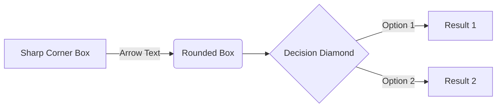

## Project Title

All things change, and all things in this document and its template will evolve over time. Keep records when things go unexpectedly.

## Current Intent

What's the idea? What are you currently trying to do? What are you trying to get out of the whole thing?

## Inspiration

You'll be reinventing the wheel if you don't go to the market and see what other people have already done.

- A
- B

## Resources

Influence is one thing. You've got to start somewhere, hopefully a few somewheres, each of them workable. You get more results faster by refactoring rather than starting over.

- C
- D

## Method

How does it actually work? Diagram or brief overview; save details for additional docs.

## Goals

What is the bare minimum it takes to have a "usable" result? Without an off ramp you're investing in a new lifestyle.

First words, then lists, then diagrams. Think big and prune. Actionable tasks are better than goals.

- [ ] Main thing to do
  - [x] There are always parts to it
  - [ ] More than one thing makes a list
- [ ] Make a follow up task

## Plans

> Remember that *tasks* age like milk, not like wine.

Only **schedule** what is necessary. Ideas go in an "IDEAS.md" file, not the road-map. *Then* select tasks from the pool of ideas.

## Testing

How do you know how well it's going? How do you know where you left off? How do you know if you broke something that used to work fine?

You can't see everything all at once: make unit tests or you'll be in trouble when you come back after a hiatus.

## Dependencies

What technologies does this assume you have installed and how would other people find and install it?

## Layout

I just opened this folder; What is all of it? How are things laid out?

How do I build and run? How do I run unit tests or make changes? How do I file a bug report?

## References

If you need a thing go [to the source](src)!

[src]: www.alwayslistyoursources.com
